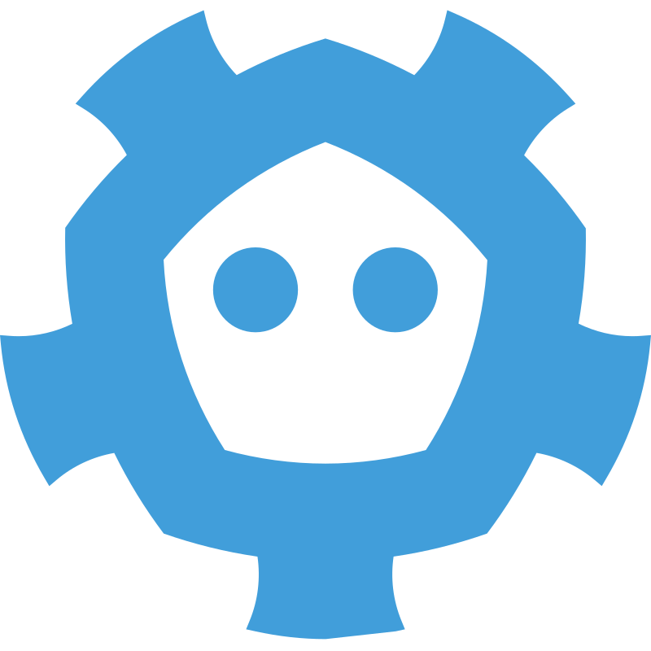

[](https://vshymanskyy.github.io/StandWithUkraine/)

### 📢 [Updates from Ukrainian Open Source Community](https://github.com/vshymanskyy/StandWithUkraine/blob/main/docs/CommunityUpdates.md)
<hr>

<h3>Hi! I`m passionate senior software engineer from 🇺🇦</h3>

 [](https://github.com/olenindenis/?tab=follow)   [](https://www.linkedin.com/in/denis-olenin-b66ab082/)
[](https://www.learn-c.org/)
[](https://go.dev/)
[](https://www.php.net/)

## About me

I have worked at a number of companies gaining teamwork and a lot of skills.
As well I have experience with private clouds and building big projects from scrath. I am most skilled in:

```shell
programmingLangs
 ├─Go
 ├─C
 ├─PHP
 └─Python

databases
 ├─PostgreSQL
 ├─MySQL
 ├─Mongodb
 ├─Redis
 ├─Memcached
 ├─DragonflyDB
 ├─Cassandra
 ├─etcd
 ├─Clickhouse
 └─Elasticsearch

dataBuses
 ├─Kafka
 ├─RabbitMQ
 └─Nats

proxyServers
 ├─nginx
 ├─traefik
 ├─haproxy
 └─envoy

automationTools
 ├─Terraform
 ├─Ansible
 ├─GitHub Actions
 └─GitLab CI

observability
 ├─Grafana
 ├─Prometheus
 ├─Loki
 └─Tempo

infrastructure
 ├─vault
 ├─consul
 ├─Docker
 ├─Docker-compose
 ├─Kubernetes
 ├─DTM
 └─Temporal
```

<h2>🚀 Tools/ Technologies/ What I use/used</h2>

<h3>Programming langs</h2>

<div style="display: flex; align-items: flex-start; align: center">
<table align="center">
  <tr>
      <td align="center"  width="88">
        
        <br>Go
      </td>
      <td align="center" width="88">
        
        <br>C
      </td>
      <td align="center" width="88">
        
        <br>PHP
      </td>
      <td align="center" width="88">
        
        <br>Python
      </td>
  </tr>
</table>
</div>

<div style="display: flex; align-items: flex-start; align: center">
<table align="center">
  <tr>
      <td align="center"  width="88">
        
        <br>Go
      </td>
      <td align="center" width="88">
        
        <br>C
      </td>
      <td align="center" width="88">
        
        <br>PHP
      </td>
      <td align="center" width="88">
        
        <br>Python
      </td>
    <td align="center" width="88">
        
      <br>Python
    </td>
    <td align="center" width="88">
        
      <br>React.js
    </td>
    <td align="center" width="88">
        
      <br>Next.js
    </td>
    <td align="center" width="88">
      
      <br>Node.js
    </td>
        <td align="center" width="88">
       
      <br>SQL
      </td>
  </tr>
    <td align="center" width="88">
        
      <br>Sass
    </td>
    <td align="center" width="88"> 
        
      <br>BEM
    </td>
    <td align="center"  width="88">
        
      <br>Tailwind
    </td>
    <td align="center" width="88">
        
      <br>Redux
    </td>
      <td align="center" width="88">
        
      <br>Postman
    </td>
      </td>
      <td align="center" width="88">
        
      <br>MongoDB
     </td>
     <td align="center" width="88">
        
      <br>Git
    </td>
  <td align="center" width="88">
        
      <br>VSCode
     </td>
  <td align="center" width="88">
        
      <br>Figma
     </td>
</table>

<h2>🚀 Tools/ Technologies/ What I use/used</h2>
<p align="left">





</p>

---
## 💻 Statistics

<p>
  
<a href="https://github.com/olenindenis/olenindenis">
  
</a>

  </p>
